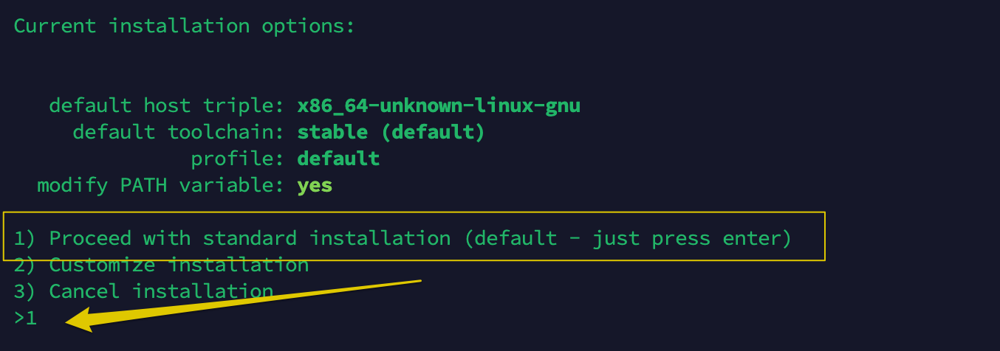
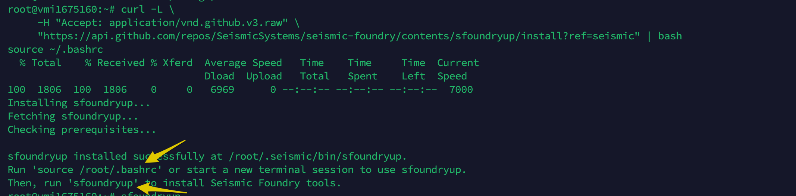
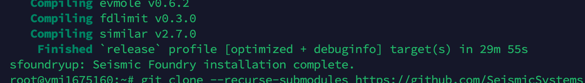
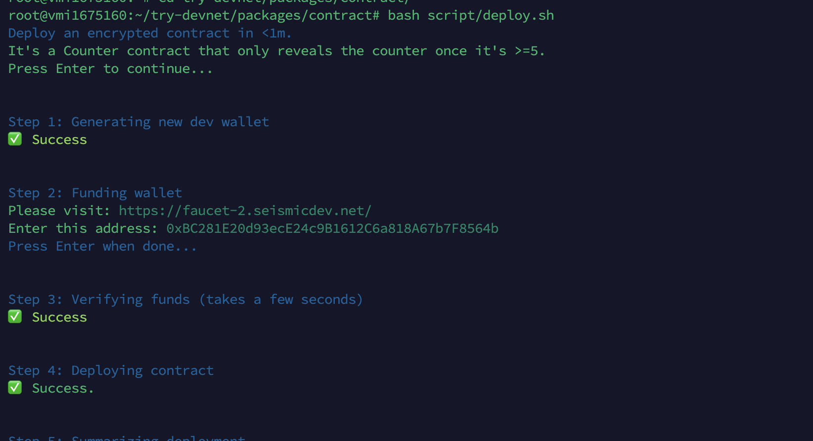
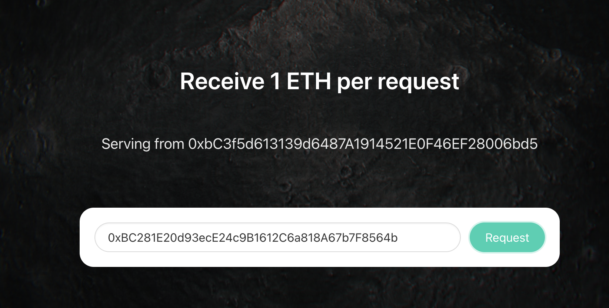
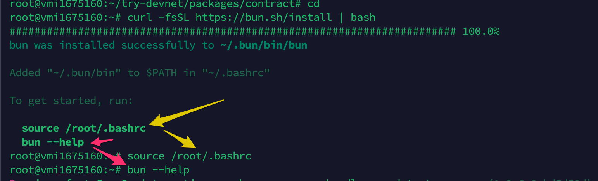
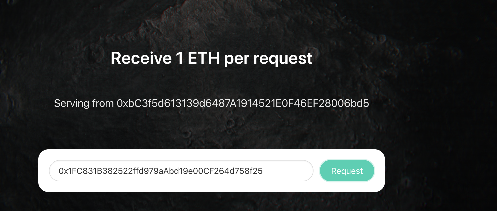

# Seismic Devnet Create and Interact with First contract

# Overview

Welcome! This walkthrough is quick. It only requires a minute of actual attention, while the rest is waiting.

*Also note, this is not an incentivized testnet.*

# Hardware

The minimum hardware requirements for running an Initia node are:

```bash
CPU: 2 cores

Memory: 4GB RAM

```

# OS requirements

- window with wsl
- macos
- ubuntu

# Deploy an encrypted contract

## Step 1

Update all the packages

```bash
curl https://sh.rustup.rs -sSf | sh
```

then choose option 1



wait for installing finish 

last step run

```bash
. "$HOME/.cargo/env"
```

## Step2: 

install `jq`

for macos: 

```bash
brew install jq
```
for ubuntu: 

```bash
sudo apt install jq
```

## Step 3

Install sfoundryup

```bash
curl -L \
     -H "Accept: application/vnd.github.v3.raw" \
     "https://api.github.com/repos/SeismicSystems/seismic-foundry/contents/sfoundryup/install?ref=seismic" | bash
```

After that you will see this message. 



then try to follow the command inside of message


```bash
source /root/.bashrc
```

and 

```bash
sfoundryup
```
it steps need to be wait until you see this




## step 4

clone the repository

```bash
git clone --recurse-submodules https://github.com/SeismicSystems/try-devnet.git
```
then 

```bash
cd try-devnet/packages/contract/
```

## Step 5 

Deploy contract

```bash
bash script/deploy.sh
```

inside of script for
- step 1: just hit enter
- step 2: 


go to https://faucet-2.seismicdev.net/ and then enter the address show on image to get token.



wait 15-30 seconds then hit enter and enjoys the rest. 

# Interact with deploy contract

## step 1

install **bun**

```bash
cd
curl -fsSL https://bun.sh/install | bash
```
then you will see this and try to follow the command from suggestion 



## step 2 

run 
```bash
cd try-devnet/packages/cli/
bun install
```
## step 3

run 

```bash
bash script/transact.sh
```
you will see this again. inside
- step1: hit enter
- step2: 


go to https://faucet-2.seismicdev.net/ and then enter the address show on image to get token.



wait 15-30 seconds then hit enter and enjoys the rest. 

when you come to this place. You are doing the good job.

Take the screenshot both 2 Deploy and interact an encrypted contract.  Then post it on it X. https://x.com/leiz95/status/1904779356053946544

<3 Happy Hacking!!! <3