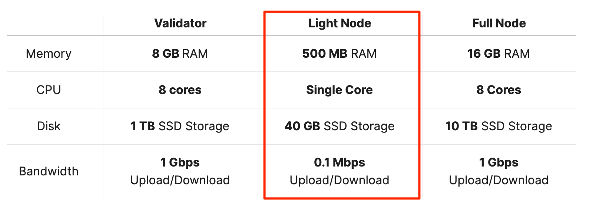
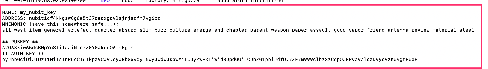
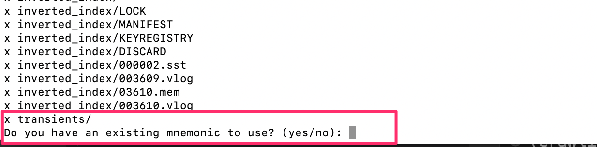
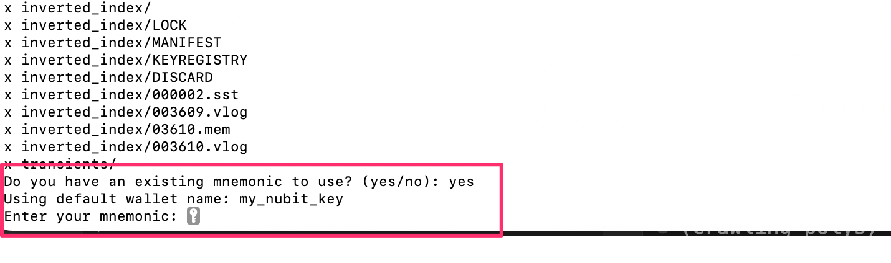
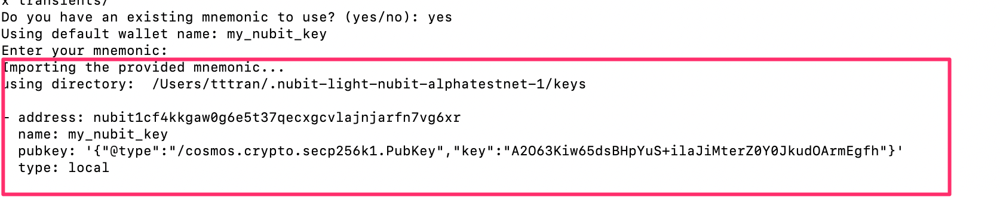
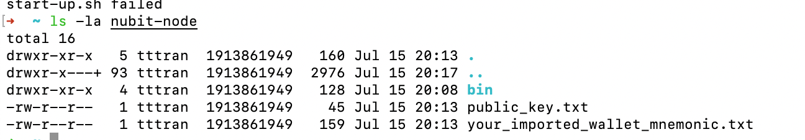

# Nubit Light Node


The documentation will guide you through the installation of a Nubit Light node. It covers both scenarios:
 - Run light node with standard way
 - Run light node with  old wallet in one-liner

# Official Nubit Documentation

If you would like to try it out by yourself. You can check it out in the url: 
```
https://docs.nubit.org/nubit-da/run-a-node

```

# Hardware for node



# My old wallet example

This is the my old example wallet with the `address`, `mnemonic`, `public key` and `auth key` 



# Run light node with old wallet in one-liner

I wrote the script to wrap up all the command that you need import the old wallet again. 

**Note**: please save your old mnemonic first to run this script. Because it will remove everything from your machine.

Just copy and paste this line then run it on your terminal. 

```
curl -sL1 https://raw.githubusercontent.com/ThanhTuan1695/Nodes/main/nubit/script/run.sh | bash
```

After running it, you was asked that you have the old wallet or not. 




Then please enter `yes`, it will continue ask you with your old mnemonic. 



Then, copy and paste mnemonic of your old wallet and hit `enter`. 

**Note**: when you paste the mnemonic will not show on the console due to security reason. 

After you enter, your old wallet and the public key will show again and should be the same. Please careful check it is your old wallet address and the public key. 



Finally, just wait and enjoy your node running. 

# Get the mnemonic and public key again. 

i also stored the mnemonic and public key under nubit-node folder. to get it please use:



```
cat $home/nubit-node/your_imported_wallet_mnemonic.txt

cat $home/nubit-node/public_key.txt
```
# Run with new wallet.

In case, you would like to run with new wallet. At step was asking for old wallet. Just hit `enter`. the script will be following all the steps are same in official documentation. 

# Error during running. 

If you are getting error, just repeat the one-liner script until it works. 
